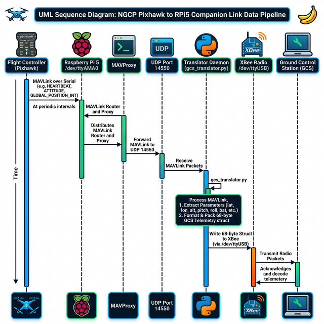

# NGCP Pixhawk ↔ Raspberry Pi 5 Companion Link

This repo is a **focused playbook + helper scripts** to validate and operationalize a **MAVLink UART link (TELEM2)** between a Pixhawk/Cube flight controller and a Raspberry Pi 5 companion computer, and to securely route that telemetry to the **Ground Control Station (GCS)** over an XBee radio.
Note: Scripts and workflow are tailored specifically for CPP MRA and GCS. CPSLO MEA may use this Github repo with caution and it is strongly advised to use this repo as a template.

## What you get
- Step-by-step SOPs for UART bring-up and validation.
- Autostart helpers to launch MAVProxy on Pi boot/login.
- A **Python Translation Daemon** (`gcs_translator.py`) that converts MAVLink data into the GCS team's custom 68-byte packet structure.
- Automatic routing of telemetry from the Flight Controller -> MAVProxy (UDP) -> Translator Daemon -> XBee Radio (USB).

## Quick start (Pi 5 desktop)
1. Plug your XBee Radio into any available USB port on the Pi 5.
2. Install the MAVProxy/Translator autostart helpers:
   ```bash
   ./scripts/install-mavproxy-autostart.sh
   ```
3. Reboot and log into the GNOME desktop.
4. A terminal should open. MAVProxy will detect the vehicle, and the background translator daemon will begin streaming data to the GCS!

## Architecture & Integration


> *Note: This data pipeline overview was generated using Nano Banana Pro and is subject to change as the repository is updated.*

The autostart script (`ngcp-mavproxy-telemetry.sh`) currently spins up the following MAVLink routing pipeline:
1. **MAVProxy (`mavproxy.py`)**: Connects physically to the Pixhawk over `/dev/ttyAMA0` (Serial0) at 57600 baud. It broadcasts all incoming MAVLink frames locally to four dedicated UDP ports:
   - `14550`: GCS Translator Daemon
   - `14540`: Pre-configured for the Software Team's **MAVSDK** autonomy scripts
   - `14601`: Pre-configured for the Software Team's `command_listener.py`
   - `14602`: Pre-configured for the Software Team's future Autonomy Engine (e.g., KrakenSDR integration)
2. **GCS Translator (`gcs_translator.py`)**: A Python daemon that listens to UDP `14550`. It extracts specific data (Lat, Lon, Alt, Speed, Pitch, Roll, Yaw, Battery), packs it into the GCS team's `Telemetry` struct, and transmits it via the XBee API out of an automatically-detected `/dev/ttyUSB*` port.

### Dual-Control Arbitration (GCS vs. Autonomy)
To safely allow both the GCS and the Software Team's scripts to send commands to the flight controller without collision, control authority is managed via standard flight modes:
- **Offboard/Guided Mode:** Gives the Software Team's Autonomy Engine authority to autonomously navigate the drone.
- **Loiter/Manual/RTL Mode:** Gives the GCS or RC operator absolute manual override authority, causing the flight controller to safely reject the Autonomy Engine's trajectory commands.

### GCS Subteam API Integration Resolves
In March 2026, the GCS Subteam significantly altered their telemetry API (`InfrastructureInterface`) by nesting payload definitions inside `lib/gcs-packet/Packet/` and changing Python standard dictionary packing `.encode()` to a proprietary `.Encode()` format. These undocumented branch mismatches crashed the `gcs_translator.py` background daemon silently on launch, halting telemetry web-hooks. 
**Resolution:** The Pi 5 companion daemon now implicitly maps 4 layers deep into the newest `sys.path` to grab the raw dependencies and strictly uses their capitalized string definitions, successfully resolving the heartbeat stream. (See `docs/gcs_integration_fixes.md` for post-mortem).

## Optional: Tailscale VPN for Reliable SSH
Due to the dynamic IP addressing (DHCP) on university networks and active blocking of local Multicast (mDNS), it can be difficult to reliably connect to the Raspberry Pi 5 companion computer over SSH (e.g. the IP changes every time it reconnects).
To bypass these restrictions and avoid having a roaming IP address on every reboot, it is highly recommended to use **Tailscale**. Tailscale is a free, lightweight mesh VPN that assigns a permanent, static `100.x.x.x` IP address to the Pi 5.
- It bypasses university NAT and firewall restrictions seamlessly by establishing secure peer-to-peer tunnels.
- It allows you to SSH into the Pi 5 from anywhere (even off-campus) using the same IP address.
- To set it up, simply install Tailscale on both your development machine and the Pi 5, authenticate with the same account, and use the provided Tailscale IP in your SSH configuration.

## Documentation (start here)
Readers, current users, and future users should refer to the dedicated GitHub wiki pages for this repo for more detailed information.

Detailed SOPs live in `docs/wiki` (mirrors the GitHub Wiki).

1. `docs/wiki/MAVProxy-Autostart.md`
2. `docs/wiki/UART-MAVLink-Validation.md` *(planned)*

## Repo layout
- `docs/wiki/` – wiki-ready SOPs
- `scripts/` – MAVProxy helpers, autostart installer, and integration daemons.

### Script inventory
- `scripts/install-mavproxy-autostart.sh` – installs helpers into `~/.local/bin` and creates a GNOME desktop autostart entry.
- `scripts/ngcp-mavproxy-autostart.sh` – opens a terminal emulator and runs the telemetry helper.
- `scripts/ngcp-mavproxy-telemetry.sh` – launches MAVProxy (to UDP) and the Translator Daemon in the background.
- `scripts/gcs_translator.py` – The Python script bridging MAVLink and the external GCS radio.
- `scripts/mavlink_hub.py` – **[PLANNED]** Publish-subscribe MAVLink broker (deferred — pending cross-team coordination, see [`TODO.md`](TODO.md)).
- `scripts/test_mavlink_hub.py` – **[PLANNED]** Unit test suite for the hub (7 tests, runs without hardware).

## Upcoming Features

### 🔌 Automatic UDP Port Registration for External Scripts
Currently, any new script that needs access to the live MAVLink stream must manually add a `--out udp:127.0.0.1:<PORT>` entry to the `ngcp-mavproxy-telemetry.sh` launch script and reboot. This creates friction for other subteams.

A planned enhancement is a **dynamic UDP port manager** where external scripts can announce themselves at runtime. MAVProxy (or a lightweight multiplexer) would then automatically stand up a new output UDP stream for them — no launch script edits, no reboot required. The goal is a plug-and-play data bus so scripts from the Software, GCS, and Autonomy subteams can consume MAVLink data independently without stepping on each other.

### 🖥️ Active UDP Port Monitor in the GUI
The GCS Telemetry Monitor (`gui_server.py`) currently only displays live telemetry fields. A planned **"Port Monitor" panel** will be added to the web GUI that shows:
- All active MAVLink UDP listeners on the Pi 5 (e.g., `14550 → gcs_translator.py`, `14601 → command_listener.py`)
- Live heartbeat status per port (green = active, red = silent >5s)
- A simple `/ports` REST endpoint on `gui_server.py` to serve this data

This gives operators a real-time health overview of the entire data bus at a glance.

> See [`TODO.md`](TODO.md) for a full backlog including pending GCS compatibility fixes.

## Status
- ✅ UART device mapping confirmed on Pi 5 (`/dev/ttyAMA0`)
- ✅ MAVLink frames observed on TELEM2
- ✅ MAVProxy receives heartbeat + parameters
- ✅ GCS Custom Translation Pipeline Implemented (MAVLink -> UDP -> Python -> XBee)
- ✅ GCS Infrastructure API compatibility fixes resolved (see `docs/gcs_integration_fixes.md`)

## Contributing
Update `docs/wiki` first, then mirror to the GitHub Wiki.
